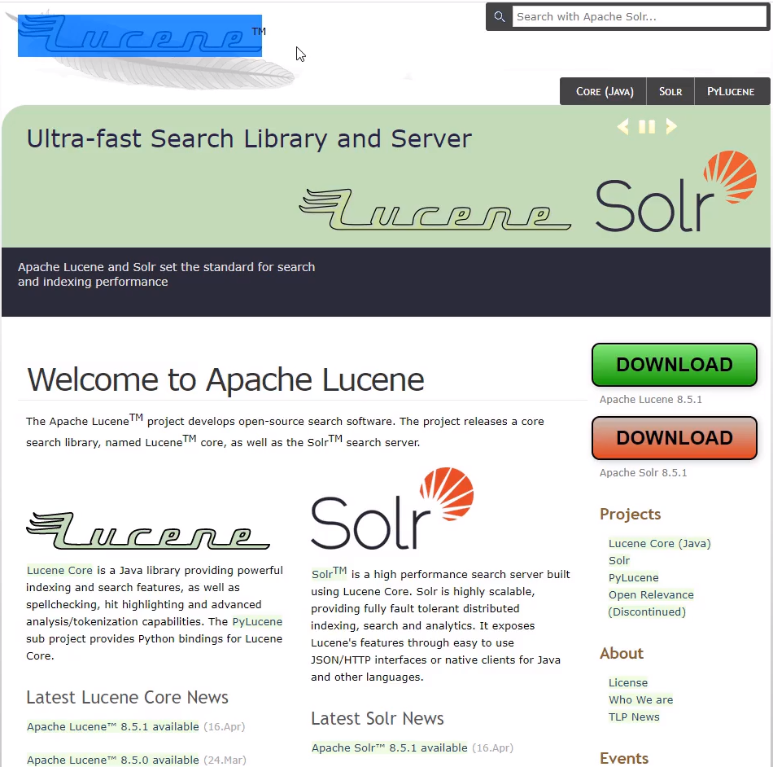

# 一,Elasticsearch介绍

### 1.1 引言

> 1. 在海量数据中执行搜索功能时,如果使用mysqlo,效率太低.
> 2. 如果关键字输入的不准确,一样可以搜索到想要的数据
> 3. 将搜索关键字,以红色字体展示

### 1.2 ES的介绍

> ES是一个使用Java语言并且基于Lucene编写的搜索引擎框架,他提供了分布式的全文搜索功能,
>
> 提供了一个同意的基于RERTful风格的WEB接口,官方客户端也对多种语言都提供了响应的API.

>Lucene: Lucene本身就是一个搜索引擎的底层.(你可以理解为一个jar包)
>
>ES就是基于Lucene封装出来的

Lucene的官方:http://lucene.apache.org

apache官方也不推荐你直接使用Lucene

在他的下面有一个Solr,而这个Solr也是基于Lucene实现的.

>分布式:ES主要是为了突出他的横向扩展能力

> 全文检索:将一段词语进行分词,并且将分出的单个词语统一的放到一个分词库中,在搜索中,根据关键字去分词库中检索,找到匹配的内容(倒排索引)

> RESTful风格的WEB接口:操作ES很简单,只需要发送一个HTTP请求,并且根据请求方式的不同,携带参数的不同,执行响应的功能.

> 应用广泛:Github.com, WIKI, Gold Man用ES每天维护将近10TB数据

### 1.3 关于ES诞生的那点儿事儿:

