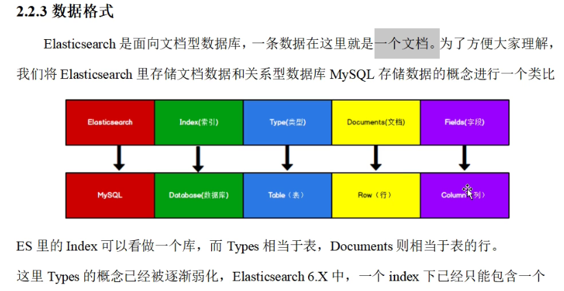
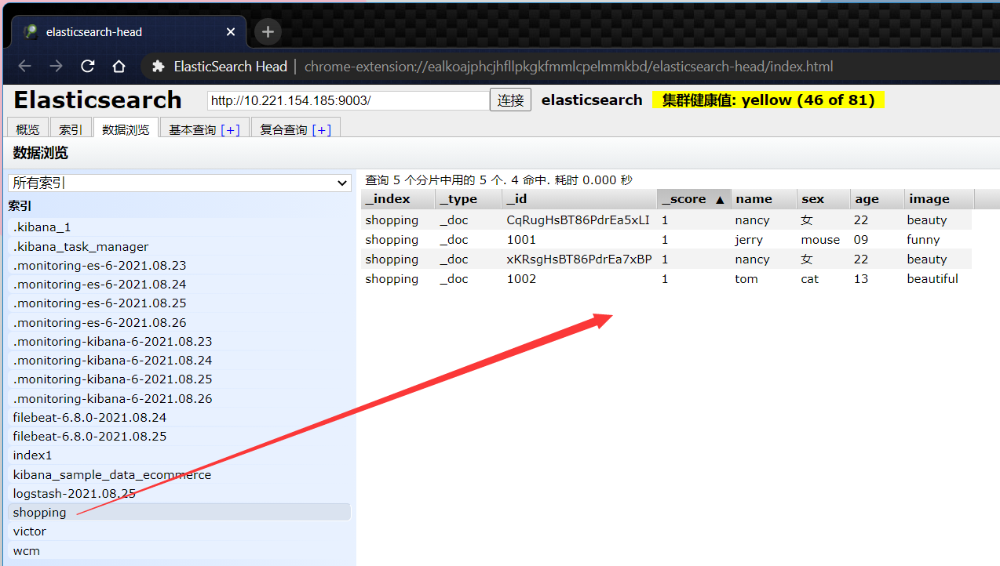

# 001-开篇

结构化数据和非结构化数据

课件: [sgg_elasticsearch](https://victorfengming.gitee.io/file/pdf/elk/sgg_elasticsearch.pdf)

# 002-技术选型

Elastic Stack的核心

Elasticsearch是一个分布式、RESTful风格的搜索和数据分析引擎，能够解决不断涌现出的各种用例。作为Elastic
Stack的核心，它集中存储您的数据，帮助您发现意料之中以及意料之外的情况

The Elastic Stack，包括 Elasticsearch、Kibana、Beats和 Logstash(也称为ELK Stack)。能够安全可靠地获取任何来源、在何格式的数据，然后实时地对数据进行搜索、分析和可视化。Elaticsearch,简称为ES，ES是一个开源的高扩展的分布式全文搜索引擎,是整个ElasticStack 技术栈的核心。它可以近乎实时的存储、检索数据;本身扩展性很好，可以扩展到上百台服务器，处理PB级别的数据。


# 003-教学大纲

ES和其他技术栈 集成

# 004-入门-环境准备


# 005-入门-RESTful & JSON

URI
http: /l localhost : 9200/test/test.txt
GET,POST,PUT,DELETE,HEAD
JSON
Javascript object Notation
var obj = { "name" : "zhangsan", "age": 30, "info" : { "email" : "xxxxx"} }var objs = [obj, obj]
new object ()I
JSON字符串:网络中传递的字符串的格式符合JSON格式，


# 006-入门-Postman客户端工具

idea 自带 .http 测试用例

# 007-入门-倒排索引



# 008-入门-HTTP-索引-创建

## put方式

```http
PUT http://10.221.154.185:9003/shopping2

HTTP/1.1 200 OK
Warning: 299 Elasticsearch-6.8.0-65b6179 "the default number of shards will change from [5] to [1] in 7.0.0; if you wish to continue using the default of [5] shards, you must manage this on the create index request or with an index template"
content-type: application/json; charset=UTF-8

{
  "acknowledged": true,
  "shards_acknowledged": true,
  "index": "shopping2"
}

Response code: 200 (OK); Time: 272ms; Content length: 68 bytes
```

> put操作 有 `幂等性`

```http
PUT http://10.221.154.185:9003/shopping2

HTTP/1.1 400 Bad Request
content-type: application/json; charset=UTF-8

{
  "error": {
    "root_cause": [
      {
        "type": "resource_already_exists_exception",
        "reason": "index [shopping2/ltqnduE0QtqWZErxMLo73g] already exists",
        "index_uuid": "ltqnduE0QtqWZErxMLo73g",
        "index": "shopping2"
      }
    ],
    "type": "resource_already_exists_exception",
    "reason": "index [shopping2/ltqnduE0QtqWZErxMLo73g] already exists",
    "index_uuid": "ltqnduE0QtqWZErxMLo73g",
    "index": "shopping2"
  },
  "status": 400
}

Response code: 400 (Bad Request); Time: 152ms; Content length: 377 bytes

```

---

## 而 POST 是不支持的

```http
POST http://10.221.154.185:9003/shopping2

HTTP/1.1 405 Method Not Allowed
Allow: GET,HEAD,DELETE,PUT
content-type: application/json; charset=UTF-8

{
  "error": "Incorrect HTTP method for uri [/shopping2] and method [POST], allowed: [GET, HEAD, DELETE, PUT]",
  "status": 405
}

Response code: 405 (Method Not Allowed); Time: 131ms; Content length: 120 bytes

```


# 009-入门-HTTP-索引-查询 & 删除

## 只需要改变请求方式即可

```shell
GET http://10.221.154.185:9003/shopping2

HTTP/1.1 200 OK
Warning: 299 Elasticsearch-6.8.0-65b6179 "[types removal] The parameter include_type_name should be explicitly specified in get indices requests to prepare for 7.0. In 7.0 include_type_name will default to 'false', which means responses will omit the type name in mapping definitions."
content-type: application/json; charset=UTF-8

{
  "shopping2": {
    "aliases": {},
    "mappings": {},
    "settings": {
      "index": {
        "creation_date": "1629946010925",
        "number_of_shards": "5",
        "number_of_replicas": "1",
        "uuid": "ltqnduE0QtqWZErxMLo73g",
        "version": {
          "created": "6080099"
        },
        "provided_name": "shopping2"
      }
    }
  }
}

Response code: 200 (OK); Time: 207ms; Content length: 237 bytes

```


## 查看所有索引

```shell
GET http://10.221.154.185:9003/_cat/indices?v=

HTTP/1.1 200 OK
content-type: application/json; charset=UTF-8

[
  {
    "health": "green",
    "status": "open",
    "index": ".monitoring-es-6-2021.08.26",
    "uuid": "d6g3cn54S1-BHihWWWq8Xg",
    "pri": "1",
    "rep": "0",
    "docs.count": "23479",
    "docs.deleted": "799",
    "store.size": "12.9mb",
    "pri.store.size": "12.9mb"
  },
  {
    "health": "green",
    "status": "open",
    "index": ".monitoring-kibana-6-2021.08.26",
    "uuid": "D2hUxM19RK2BXMsjYSHwqw",
    "pri": "1",
    "rep": "0",
    "docs.count": "3284",
    "docs.deleted": "0",
    "store.size": "742.5kb",
    "pri.store.size": "742.5kb"
  },
  {
    "health": "green",
    "status": "open",
    "index": ".kibana_1",
    "uuid": "3kfy0k8wRH-TIK6uADsgeA",
    "pri": "1",
    "rep": "0",
    "docs.count": "23",
    "docs.deleted": "2",
    "store.size": "939.3kb",
    "pri.store.size": "939.3kb"
  },
  {
    "health": "green",
    "status": "open",
    "index": ".monitoring-kibana-6-2021.08.23",
    "uuid": "EmCEEvOqT5yiTHM4AVbNOw",
    "pri": "1",
    "rep": "0",
    "docs.count": "12622",
    "docs.deleted": "0",
    "store.size": "2.5mb",
    "pri.store.size": "2.5mb"
  },
  {
    "health": "yellow",
    "status": "open",
    "index": "logstash-2021.08.25",
    "uuid": "5wAHDGeuTuyD2sQ1md1S7Q",
    "pri": "5",
    "rep": "1",
    "docs.count": "6",
    "docs.deleted": "0",
    "store.size": "29.5kb",
    "pri.store.size": "29.5kb"
  },
  {
    "health": "yellow",
    "status": "open",
    "index": "index1",
    "uuid": "mY9diN_nTEeEW6Q2CqM7Lw",
    "pri": "5",
    "rep": "1",
    "docs.count": "0",
    "docs.deleted": "0",
    "store.size": "1.2kb",
    "pri.store.size": "1.2kb"
  },
  {
    "health": "yellow",
    "status": "open",
    "index": "shopping",
    "uuid": "Nlwy9q6hRGOqa83HPanTPA",
    "pri": "5",
    "rep": "1",
    "docs.count": "0",
    "docs.deleted": "0",
    "store.size": "1.2kb",
    "pri.store.size": "1.2kb"
  },
  {
    "health": "green",
    "status": "open",
    "index": ".monitoring-es-6-2021.08.24",
    "uuid": "KZ_dF3JjSvG9b9pWOL9lnw",
    "pri": "1",
    "rep": "0",
    "docs.count": "111107",
    "docs.deleted": "111",
    "store.size": "41.5mb",
    "pri.store.size": "41.5mb"
  },
  {
    "health": "green",
    "status": "open",
    "index": ".monitoring-kibana-6-2021.08.25",
    "uuid": "js2fp2rRRUWAINODm2yzvA",
    "pri": "1",
    "rep": "0",
    "docs.count": "25203",
    "docs.deleted": "0",
    "store.size": "5.2mb",
    "pri.store.size": "5.2mb"
  },
  {
    "health": "green",
    "status": "open",
    "index": ".monitoring-es-6-2021.08.23",
    "uuid": "oeoN6InjQDqjDldd3lbbJw",
    "pri": "1",
    "rep": "0",
    "docs.count": "63183",
    "docs.deleted": "120",
    "store.size": "24.3mb",
    "pri.store.size": "24.3mb"
  },
  {
    "health": "yellow",
    "status": "open",
    "index": "victor",
    "uuid": "Mm8HtnTbRs6JYS1rJNZYZA",
    "pri": "5",
    "rep": "1",
    "docs.count": "0",
    "docs.deleted": "0",
    "store.size": "1.2kb",
    "pri.store.size": "1.2kb"
  },
  {
    "health": "yellow",
    "status": "open",
    "index": "wcm",
    "uuid": "mY074hdvTbyfBIrbnOSMeQ",
    "pri": "5",
    "rep": "1",
    "docs.count": "0",
    "docs.deleted": "0",
    "store.size": "1.2kb",
    "pri.store.size": "1.2kb"
  },
  {
    "health": "green",
    "status": "open",
    "index": ".monitoring-es-6-2021.08.25",
    "uuid": "mx1jVv4XQZ-Zy9XCeG_dgg",
    "pri": "1",
    "rep": "0",
    "docs.count": "162119",
    "docs.deleted": "276",
    "store.size": "76.7mb",
    "pri.store.size": "76.7mb"
  },
  {
    "health": "yellow",
    "status": "open",
    "index": "filebeat-6.8.0-2021.08.25",
    "uuid": "Eup3hDEfSC6o1JyrIjoqjw",
    "pri": "5",
    "rep": "1",
    "docs.count": "12",
    "docs.deleted": "0",
    "store.size": "95.6kb",
    "pri.store.size": "95.6kb"
  },
  {
    "health": "yellow",
    "status": "open",
    "index": "shopping2",
    "uuid": "ltqnduE0QtqWZErxMLo73g",
    "pri": "5",
    "rep": "1",
    "docs.count": "0",
    "docs.deleted": "0",
    "store.size": "1.2kb",
    "pri.store.size": "1.2kb"
  },
  {
    "health": "green",
    "status": "open",
    "index": ".monitoring-kibana-6-2021.08.24",
    "uuid": "9NyFK509Rji_S8SVBNwQ-Q",
    "pri": "1",
    "rep": "0",
    "docs.count": "16611",
    "docs.deleted": "0",
    "store.size": "3.2mb",
    "pri.store.size": "3.2mb"
  },
  {
    "health": "green",
    "status": "open",
    "index": ".kibana_task_manager",
    "uuid": "i_nepgs2QSOWDtUpyzQo7Q",
    "pri": "1",
    "rep": "0",
    "docs.count": "2",
    "docs.deleted": "0",
    "store.size": "13.3kb",
    "pri.store.size": "13.3kb"
  },
  {
    "health": "green",
    "status": "open",
    "index": "kibana_sample_data_ecommerce",
    "uuid": "bOVjHpisQrOqOGbk7j3ylA",
    "pri": "1",
    "rep": "0",
    "docs.count": "4675",
    "docs.deleted": "0",
    "store.size": "4.7mb",
    "pri.store.size": "4.7mb"
  },
  {
    "health": "yellow",
    "status": "open",
    "index": "filebeat-6.8.0-2021.08.24",
    "uuid": "MKL1vgIAQ927I0G6wSIA1w",
    "pri": "5",
    "rep": "1",
    "docs.count": "2",
    "docs.deleted": "0",
    "store.size": "17.5kb",
    "pri.store.size": "17.5kb"
  }
]

Response code: 200 (OK); Time: 170ms; Content length: 3889 bytes

```

## 删除索引

```shell
DELETE http://10.221.154.185:9003/shopping2

HTTP/1.1 200 OK
content-type: application/json; charset=UTF-8

{
  "acknowledged": true
}

Response code: 200 (OK); Time: 161ms; Content length: 21 bytes

```


# 010-入门-HTTP-文档-创建（Put & Post）

索引已经创建好了，接下来我们来创建文档，并添加数据。这里的文档可以类比为关系型数据库中的表数据，添加的数据格式为JSON格式
在Postman中，向ES服务器发POST请求: http://127.0.0.1:9200/shopping/l_doc

```shell
POST http://10.221.154.185:9003/shopping/_doc

HTTP/1.1 400 Bad Request
content-type: application/json; charset=UTF-8

{
  "error": {
    "root_cause": [
      {
        "type": "parse_exception",
        "reason": "request body is required"
      }
    ],
    "type": "parse_exception",
    "reason": "request body is required"
  },
  "status": 400
}

Response code: 400 (Bad Request); Time: 119ms; Content length: 163 bytes

```

## POST请求体必须要有

```shell

POST http://10.221.154.185:9003/shopping/_doc
Accept: application/json
Content-Type: application/json


{
  "name": "nancy",
  "sex": "女",
  "age": "22",
  "image": "beauty"
}

###

```

```shell
POST http://10.221.154.185:9003/shopping/_doc

HTTP/1.1 201 Created
Location: /shopping/_doc/xKRsgHsBT86PdrEa7xBP
content-type: application/json; charset=UTF-8

{
  "_index": "shopping",
  "_type": "_doc",
  "_id": "xKRsgHsBT86PdrEa7xBP",
  "_version": 1,
  "result": "created",
  "_shards": {
    "total": 2,
    "successful": 1,
    "failed": 0
  },
  "_seq_no": 0,
  "_primary_term": 1
}

Response code: 201 (Created); Time: 130ms; Content length: 175 bytes

```

## 这里能用PUT

```shell
PUT http://10.221.154.185:9003/shopping/_doc

HTTP/1.1 405 Method Not Allowed
Allow: POST
content-type: application/json; charset=UTF-8

{
  "error": "Incorrect HTTP method for uri [/shopping/_doc] and method [PUT], allowed: [POST]",
  "status": 405
}

Response code: 405 (Method Not Allowed); Time: 120ms; Content length: 105 bytes

```

> post中的返回体的 _id 是由ES软件生成的,
>
> post同样的请求,返回的id结果不一样,说明我们的post请求不是幂等的
>
> 但是这个id 他很随机,不好记,我门也可以自己定义ID
>
> 


## 幂等性的操作 POST

```shell
POST http://10.221.154.185:9003/shopping/_doc/1001

HTTP/1.1 201 Created
Location: /shopping/_doc/1001
content-type: application/json; charset=UTF-8

{
  "_index": "shopping",
  "_type": "_doc",
  "_id": "1001",
  "_version": 1,
  "result": "created",
  "_shards": {
    "total": 2,
    "successful": 1,
    "failed": 0
  },
  "_seq_no": 1,
  "_primary_term": 1
}

Response code: 201 (Created); Time: 123ms; Content length: 159 bytes

```

## 换PUT也可以了这回(幂等性)

```shell
PUT http://10.221.154.185:9003/shopping/_doc/1002

HTTP/1.1 201 Created
Location: /shopping/_doc/1002
content-type: application/json; charset=UTF-8

{
  "_index": "shopping",
  "_type": "_doc",
  "_id": "1002",
  "_version": 1,
  "result": "created",
  "_shards": {
    "total": 2,
    "successful": 1,
    "failed": 0
  },
  "_seq_no": 0,
  "_primary_term": 1
}

Response code: 201 (Created); Time: 101ms; Content length: 159 bytes

```


# 011-入门-HTTP-查询-主键查询 & 全查询

## 主键查询(上来先GET)

### 存在的

```shell
GET http://10.221.154.185:9003/shopping/_doc/1001

HTTP/1.1 200 OK
content-type: application/json; charset=UTF-8

{
  "_index": "shopping",
  "_type": "_doc",
  "_id": "1001",
  "_version": 1,
  "_seq_no": 1,
  "_primary_term": 1,
  "found": true,
  "_source": {
    "name": "tom",
    "sex": "cat",
    "age": "13",
    "image": "beautiful"
  }
}

Response code: 200 (OK); Time: 100ms; Content length: 190 bytes

```

### 如果不存在

```shell
GET http://10.221.154.185:9003/shopping/_doc/2001

HTTP/1.1 404 Not Found
content-type: application/json; charset=UTF-8

{
  "_index": "shopping",
  "_type": "_doc",
  "_id": "2001",
  "found": false
}

Response code: 404 (Not Found); Time: 94ms; Content length: 63 bytes

```

## 全部查询(search)

```shell
GET http://10.221.154.185:9003/shopping/_search

HTTP/1.1 200 OK
content-type: application/json; charset=UTF-8

{
  "took": 1,
  "timed_out": false,
  "_shards": {
    "total": 5,
    "successful": 5,
    "skipped": 0,
    "failed": 0
  },
  "hits": {
    "total": 4,
    "max_score": 1.0,
    "hits": [
      {
        "_index": "shopping",
        "_type": "_doc",
        "_id": "CqRugHsBT86PdrEa5xLI",
        "_score": 1.0,
        "_source": {
          "name": "nancy",
          "sex": "女",
          "age": "22",
          "image": "beauty"
        }
      },
      {
        "_index": "shopping",
        "_type": "_doc",
        "_id": "1001",
        "_score": 1.0,
        "_source": {
          "name": "tom",
          "sex": "cat",
          "age": "13",
          "image": "beautiful"
        }
      },
      {
        "_index": "shopping",
        "_type": "_doc",
        "_id": "xKRsgHsBT86PdrEa7xBP",
        "_score": 1.0,
        "_source": {
          "name": "nancy",
          "sex": "女",
          "age": "22",
          "image": "beauty"
        }
      },
      {
        "_index": "shopping",
        "_type": "_doc",
        "_id": "1002",
        "_score": 1.0,
        "_source": {
          "name": "tom",
          "sex": "cat",
          "age": "13",
          "image": "beautiful"
        }
      }
    ]
  }
}

Response code: 200 (OK); Time: 120ms; Content length: 763 bytes

```


# 012-入门-HTTP-全量修改 & 局部修改 & 删除

## & 全量修改

```shell
###
PUT http://10.221.154.185:9003/shopping/_doc/1001
Accept: application/json
Content-Type: application/json


{
  "name": "jerry",
  "sex": "mouse",
  "age": "09",
  "image": "funny"
}

```


```shell
PUT http://10.221.154.185:9003/shopping/_doc/1001

HTTP/1.1 200 OK
content-type: application/json; charset=UTF-8

{
  "_index": "shopping",
  "_type": "_doc",
  "_id": "1001",
  "_version": 2,
  "result": "updated",
  "_shards": {
    "total": 2,
    "successful": 1,
    "failed": 0
  },
  "_seq_no": 2,
  "_primary_term": 1
}

Response code: 200 (OK); Time: 116ms; Content length: 159 bytes

```

查询



## & 局部修改


## & 删除

```shell
DELETE http://10.221.154.185:9003/shopping/_doc/1001

HTTP/1.1 200 OK
content-type: application/json; charset=UTF-8

{
  "_index": "shopping",
  "_type": "_doc",
  "_id": "1001",
  "_version": 3,
  "result": "deleted",
  "_shards": {
    "total": 2,
    "successful": 1,
    "failed": 0
  },
  "_seq_no": 3,
  "_primary_term": 1
}

Response code: 200 (OK); Time: 133ms; Content length: 159 bytes

```

不可重复删

```shell
DELETE http://10.221.154.185:9003/shopping/_doc/1001

HTTP/1.1 404 Not Found
content-type: application/json; charset=UTF-8

{
  "_index": "shopping",
  "_type": "_doc",
  "_id": "1001",
  "_version": 5,
  "result": "not_found",
  "_shards": {
    "total": 2,
    "successful": 1,
    "failed": 0
  },
  "_seq_no": 5,
  "_primary_term": 1
}

Response code: 404 (Not Found); Time: 137ms; Content length: 161 bytes

```


# 013-入门-HTTP-条件查询 & 分页查询 & 查询排序

## 条件查询

```shell
GET http://10.221.154.185:9003/shopping/_search?q=sex%3Acat

HTTP/1.1 200 OK
content-type: application/json; charset=UTF-8

{
  "took": 25,
  "timed_out": false,
  "_shards": {
    "total": 5,
    "successful": 5,
    "skipped": 0,
    "failed": 0
  },
  "hits": {
    "total": 1,
    "max_score": 0.2876821,
    "hits": [
      {
        "_index": "shopping",
        "_type": "_doc",
        "_id": "1002",
        "_score": 0.2876821,
        "_source": {
          "name": "tom",
          "sex": "cat",
          "age": "13",
          "image": "beautiful"
        }
      }
    ]
  }
}

Response code: 200 (OK); Time: 134ms; Content length: 293 bytes

```

还可以在请求体中写

```shell
###
GET http://10.221.154.185:9003/shopping/_search
Accept: application/json
Content-Type: application/json


{
"query": {
  "match": {
    "sex": "cat"
  }
 }
}

```

```shell
GET http://10.221.154.185:9003/shopping/_search

HTTP/1.1 200 OK
content-type: application/json; charset=UTF-8

{
  "took": 1,
  "timed_out": false,
  "_shards": {
    "total": 5,
    "successful": 5,
    "skipped": 0,
    "failed": 0
  },
  "hits": {
    "total": 1,
    "max_score": 0.2876821,
    "hits": [
      {
        "_index": "shopping",
        "_type": "_doc",
        "_id": "1002",
        "_score": 0.2876821,
        "_source": {
          "name": "tom",
          "sex": "cat",
          "age": "13",
          "image": "beautiful"
        }
      }
    ]
  }
}

Response code: 200 (OK); Time: 137ms; Content length: 292 bytes

```

全量查询

```shell
###
GET http://10.221.154.185:9003/shopping/_search
Accept: application/json
Content-Type: application/json


{
"query": {
  "match_all": {
  }
 }
}

```


```shell
GET http://10.221.154.185:9003/shopping/_search

HTTP/1.1 200 OK
content-type: application/json; charset=UTF-8

{
  "took": 2,
  "timed_out": false,
  "_shards": {
    "total": 5,
    "successful": 5,
    "skipped": 0,
    "failed": 0
  },
  "hits": {
    "total": 3,
    "max_score": 1.0,
    "hits": [
      {
        "_index": "shopping",
        "_type": "_doc",
        "_id": "CqRugHsBT86PdrEa5xLI",
        "_score": 1.0,
        "_source": {
          "name": "nancy",
          "sex": "女",
          "age": "22",
          "image": "beauty"
        }
      },
      {
        "_index": "shopping",
        "_type": "_doc",
        "_id": "xKRsgHsBT86PdrEa7xBP",
        "_score": 1.0,
        "_source": {
          "name": "nancy",
          "sex": "女",
          "age": "22",
          "image": "beauty"
        }
      },
      {
        "_index": "shopping",
        "_type": "_doc",
        "_id": "1002",
        "_score": 1.0,
        "_source": {
          "name": "tom",
          "sex": "cat",
          "age": "13",
          "image": "beautiful"
        }
      }
    ]
  }
}

Response code: 200 (OK); Time: 117ms; Content length: 615 bytes

```

## 分页查询

```shell
### 分页查询
GET http://10.221.154.185:9003/shopping/_search
Accept: application/json
Content-Type: application/json


{
  "query": {
    "match_all": {
    }
  },
  "from": 0,
  "size": 2

}

```

> (页码-1)*每页条数

```shell
GET http://10.221.154.185:9003/shopping/_search

HTTP/1.1 200 OK
content-type: application/json; charset=UTF-8

{
  "took": 1,
  "timed_out": false,
  "_shards": {
    "total": 5,
    "successful": 5,
    "skipped": 0,
    "failed": 0
  },
  "hits": {
    "total": 3,
    "max_score": 1.0,
    "hits": [
      {
        "_index": "shopping",
        "_type": "_doc",
        "_id": "CqRugHsBT86PdrEa5xLI",
        "_score": 1.0,
        "_source": {
          "name": "nancy",
          "sex": "女",
          "age": "22",
          "image": "beauty"
        }
      },
      {
        "_index": "shopping",
        "_type": "_doc",
        "_id": "xKRsgHsBT86PdrEa7xBP",
        "_score": 1.0,
        "_source": {
          "name": "nancy",
          "sex": "女",
          "age": "22",
          "image": "beauty"
        }
      }
    ]
  }
}

Response code: 200 (OK); Time: 213ms; Content length: 467 bytes

```

指定数据源

## 排序

```shell
### 分页查询,指定数据源
GET http://10.221.154.185:9003/shopping/_search
Accept: application/json
Content-Type: application/json


{
  "query": {
    "match_all": {
    }
  },
  "from": 0,
  "size": 2,
  "_source": [
    "name","age"
  ]
  ,
  "sort": {
    "age": {
      "order": "desc"
    }
  }
}

```


# 014-入门-HTTP-多条件查询 & 范围查询

## & 多条件查询 

```shell

### 条件查询
GET http://10.221.154.185:9003/shopping/_search
Accept: application/json
Content-Type: application/json


{
  "query": {
    "bool": {
      "must": [
        {
          "match": {
            "age": "22"
          }
        },
        {
          "match": {
            "name": "nancy"
          }
        }
      ]
    }
  }
}


```

```shell
GET http://10.221.154.185:9003/shopping/_search

HTTP/1.1 200 OK
content-type: application/json; charset=UTF-8

{
  "took": 3,
  "timed_out": false,
  "_shards": {
    "total": 5,
    "successful": 5,
    "skipped": 0,
    "failed": 0
  },
  "hits": {
    "total": 2,
    "max_score": 0.5753642,
    "hits": [
      {
        "_index": "shopping",
        "_type": "_doc",
        "_id": "CqRugHsBT86PdrEa5xLI",
        "_score": 0.5753642,
        "_source": {
          "name": "nancy",
          "sex": "女",
          "age": "22",
          "image": "beauty"
        }
      },
      {
        "_index": "shopping",
        "_type": "_doc",
        "_id": "xKRsgHsBT86PdrEa7xBP",
        "_score": 0.5753642,
        "_source": {
          "name": "nancy",
          "sex": "女",
          "age": "22",
          "image": "beauty"
        }
      }
    ]
  }
}

Response code: 200 (OK); Time: 175ms; Content length: 485 bytes

```

## 或者

```shell

### 条件查询2 或者
GET http://10.221.154.185:9003/shopping/_search
Accept: application/json
Content-Type: application/json


{
  "query": {
    "bool": {
      "should": [
        {
          "match": {
            "name": "tom"
          }
        },
        {
          "match": {
            "name": "nancy"
          }
        }
      ]
    }
  }
}


```


```shell
GET http://10.221.154.185:9003/shopping/_search

HTTP/1.1 200 OK
content-type: application/json; charset=UTF-8

{
  "took": 1,
  "timed_out": false,
  "_shards": {
    "total": 5,
    "successful": 5,
    "skipped": 0,
    "failed": 0
  },
  "hits": {
    "total": 3,
    "max_score": 0.2876821,
    "hits": [
      {
        "_index": "shopping",
        "_type": "_doc",
        "_id": "CqRugHsBT86PdrEa5xLI",
        "_score": 0.2876821,
        "_source": {
          "name": "nancy",
          "sex": "女",
          "age": "22",
          "image": "beauty"
        }
      },
      {
        "_index": "shopping",
        "_type": "_doc",
        "_id": "xKRsgHsBT86PdrEa7xBP",
        "_score": 0.2876821,
        "_source": {
          "name": "nancy",
          "sex": "女",
          "age": "22",
          "image": "beauty"
        }
      },
      {
        "_index": "shopping",
        "_type": "_doc",
        "_id": "1002",
        "_score": 0.2876821,
        "_source": {
          "name": "tom",
          "sex": "cat",
          "age": "13",
          "image": "beautiful"
        }
      }
    ]
  }
}

Response code: 200 (OK); Time: 122ms; Content length: 639 bytes

```


## & 范围查询

```shell

### 条件范围查询
GET http://10.221.154.185:9003/shopping/_search
Accept: application/json
Content-Type: application/json


{
  "query": {
    "bool": {
      "should": [
        {
          "match": {
            "name": "tom"
          }
        },
        {
          "match": {
            "name": "nancy"
          }
        }
      ],
      "filter": {
        "range": {
          "age": {
            "gt": "18"
          }
        }
      }
    }
  }
}


```

```shell
GET http://10.221.154.185:9003/shopping/_search

HTTP/1.1 200 OK
content-type: application/json; charset=UTF-8

{
  "took": 13,
  "timed_out": false,
  "_shards": {
    "total": 5,
    "successful": 5,
    "skipped": 0,
    "failed": 0
  },
  "hits": {
    "total": 2,
    "max_score": 0.2876821,
    "hits": [
      {
        "_index": "shopping",
        "_type": "_doc",
        "_id": "CqRugHsBT86PdrEa5xLI",
        "_score": 0.2876821,
        "_source": {
          "name": "nancy",
          "sex": "女",
          "age": "22",
          "image": "beauty"
        }
      },
      {
        "_index": "shopping",
        "_type": "_doc",
        "_id": "xKRsgHsBT86PdrEa7xBP",
        "_score": 0.2876821,
        "_source": {
          "name": "nancy",
          "sex": "女",
          "age": "22",
          "image": "beauty"
        }
      }
    ]
  }
}

Response code: 200 (OK); Time: 106ms; Content length: 486 bytes

```


# 015-入门-HTTP-全文检索 & 完全匹配 & 高亮查询

默认会给你分词,并存在倒排索引当中

# 016-入门-HTTP-聚合查询

https://www.bilibili.com/video/BV1hh411D7sb?p=16&spm_id_from=pageDriver

# 017-入门-HTTP-映射关系


# 018-入门-JavaAPI-环境准备


# 019-入门-JavaAPI-索引-创建


# 020-入门-JavaAPI-索引-查询 & 删除


# 021-入门-JavaAPI-文档-新增 & 修改


# 022-入门-JavaAPI-文档-查询 & 删除


# 023-入门-JavaAPI-文档-批量新增 & 批量删除


# 024-入门-JavaAPI-文档-高级查询-全量查询


# 025-入门-JavaAPI-文档-高级查询-分页查询 & 条件查询 & 字段查询


# 026-入门-JavaAPI-文档-高级查询-组合查询 & 范围查询


# 027-入门-JavaAPI-文档-高级查询-模糊查询 & 高亮查询


# 028-入门-JavaAPI-文档-高级查询-最大值查询 & 分组查询


# 029 -环境-简介


# 030-环境-Windows集群部署


# 031-环境-Linux单节点部署


# 032-环境-Linux集群部署


# 033-进阶-核心概念


# 034-进阶-系统架构-简介


# 035-进阶-单节点集群


# 036-进阶-故障转移


# 037-进阶-水平扩容


# 038-进阶-应对故障


# 039-进阶-路由计算 & 分片控制


# 040-进阶-数据写流程


# 041-进阶-数据读流程


# 042-进阶-更新流程 & 批量操作流程


# 043-进阶-倒排索引


# 044-进阶-文档搜索


# 045-进阶-文档刷新 & 文档刷写 & 文档合并


# 046-进阶-文档分析


# 047-进阶-文档控制


# 048-进阶-文档展示-Kibana


# 049-框架集成-SpringData-整体介绍


# 05-框架集成-SpringData-代码功能集成


# 051-框架集成-SpringData-集成测试-索引操作


# 052-框架集成-SpringData-集成测试-文档操作


# 053-框架集成-SpringData-集成测试-文档搜索


# 054-框架集成-SparkStreaming-集成


# 055-框架集成-Flink-集成


# 056-优化-硬件选择


# 057-优化-分片策略


# 058-优化-路由选择


# 059-优化-写入速度优化


# 060-优化-内存设置


# 061-优化-重要配置


# 062-面试题
21:45